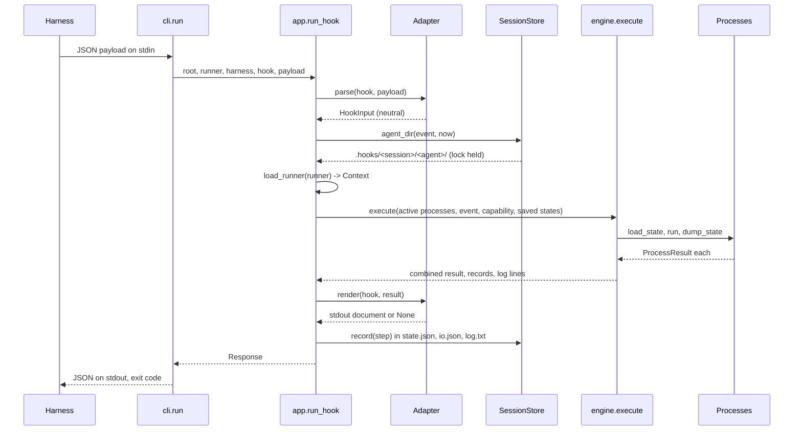

# Architecture and design

This document explains the structure of Agent Actions, the reason for each main
decision, and the places where you extend it. The requirements are in
[requirements.md](requirements.md). The per-harness field tables are in
[data-model.md](data-model.md).

## 1. The problem

A hook is a short program. A harness starts it, writes a JSON payload to stdin,
reads a JSON answer from stdout, and acts on that answer. Three things make this
hard to do by hand:

1. **Every harness has its own names and shapes.** The same rule needs three
   implementations.
2. **A wrong answer is silent.** A harness ignores output it does not expect. The
   guardrail looks alive and protects nothing.
3. **A hook process has no memory.** Each call is a new process, so "how many
   times did the agent try this?" is not answerable without files.

Agent Actions answers the three with: adapters, capability checks, and a session
store.

## 2. Layers

The dependency arrows point inward. `model` knows nothing about the rest.

```text
cli.py                       parse arguments, read stdin, write stdout (composition root)
   |
app.py                       use cases: run one hook call, install a runner file
   |            \
engine.py        session.py  run the processes | find the folders, record the step
   |                |
runtime.py       storage.py  the runner-file API | JSON files and locks
   |
process.py                   process families and state
   |
harnesses/*                  one adapter per harness, behind a factory
   |
model.py                     hooks, verdicts, tool calls, inputs, results
errors.py                    the error types
processes/*                  the included guardrails, written against model + process
```

| Module | Responsibility | Effects |
| --- | --- | --- |
| `model.py` | Types and the rules about them: a block needs a reason, the most restrictive verdict wins. | none |
| `process.py` | Process families, state declaration and restore. | none |
| `harnesses/base.py` | The adapter protocol, the tool catalog, path search, shell quoting. | none |
| `harnesses/claude.py`, `vscode.py`, `copilot_cli.py` | All names and shapes of one harness. | none |
| `runtime.py` | `get_current_context`, `Context.add` and its compatibility checks, `run`, `log`, and loading the runner file. | runs the runner file |
| `engine.py` | Run the active processes, guard their exceptions, check their results, combine them. | none of its own |
| `session.py` | Folder names, folder lookup, and the step record. | files |
| `storage.py` | Atomic JSON writes and lock files. | files |
| `app.py` | The two use cases, wired together. | files |
| `cli.py` | Arguments, stdin, stdout, exit code, interactive choice. | process I/O |

Pure logic sits at the bottom, so most of the framework is testable with plain
objects. Files and subprocesses live in `storage.py`, `session.py`, `cli.py`, and
in the processes whose job is to run a command.

## 3. One hook call, end to end



The runner file is loaded **after** the payload is parsed, so a process can see
the event in its constructor if it needs to. It is loaded **inside** the lock, so
two parallel hook calls of one agent cannot interleave their state.

## 4. Decisions

### 4.1 A neutral model, and adapters at the edge (Ports and adapters)

`HookInput` and `ProcessResult` are the port. Each harness has one adapter class
that implements `HarnessAdapter`, and `make_adapter` is the factory. A process
never names a harness, so one runner file works everywhere.

The adapter also owns the **tool catalog**: which tool names write, read, search
or run a shell. The adapter classifies the call, so a guardrail says
`tool.kind is ToolKind.WRITE` instead of listing `Edit`, `replace_string_in_file`
and `edit`.

### 4.2 Families instead of one process class

`task.md` names the failure to prevent: a stop process attached to a pre-tool
hook produces output the harness ignores, with no error. Three checks prevent it:

1. **The family** fixes the hooks a process can attach to. A `StopProcess` with
   `on=(Hook.PRE_TOOL,)` is rejected by `Context.add`.
2. **The capability table** of the adapter says which verdicts and which context
   channel a harness has per hook. `Context.add` rejects a process whose declared
   verdicts cannot be delivered.
3. **The result check** in `engine.py` catches the case the first two cannot see:
   a process that returns a verdict it never declared. The run fails with exit
   code 1 and a message on stderr.

The first two fail during `agent_actions install`, which is where a mistake is
cheap. The case `stop-process-that-asks-fails-loudly` pins the third.

### 4.3 An allow is not an approval

On `pre-tool`, an `allow` renders **no output**. An explicit
`permissionDecision: "allow"` would tell the harness to skip its own permission
prompt, so a guardrail that only meant "no objection" would silently switch off
the protection of the user. Reasons of an `allow` go to `log.txt` only, which
also keeps the agent context free of one line per tool call.

### 4.4 State by attribute diff

A process declares state by setting attributes in `__state__`. The framework
calls it once, records which attributes appeared, and uses that list to restore
and dump. The alternative, a schema or a dict, makes every process longer. The
cost is one rule: state attributes must not also be set in `__init__`.

Unknown recorded keys are ignored, and missing keys keep their initial value, so
a process can gain or lose a state variable without a migration.

### 4.5 Trimmed folder names with a collision rule

A folder name is `<timestamp>_<8 characters of the session id>`, which stays
readable and sorts by time. Eight characters are not unique, so each folder holds
a `session.json` (or `agent.json`) with the full id. Lookup matches the full id;
only the **name** is trimmed. If a name is taken, the timestamp grows by 1 ms
until it is free.

### 4.6 One lock, whole step

`run_hook` holds a lock file on the agent folder from "read the state" to "write
the step". Parallel tool calls in one agent therefore cannot lose a counter. The
lock is a file with a stale-age cutoff, marked with a `ponytail:` comment: it is
the simple form, and OS locks are the upgrade path.

### 4.7 The runner file is data, not a library

`agent_actions run` executes the runner file with `runpy`, and the file hands its
context back through `agent_actions.run(context)`. The same file serves two
commands: with a hook it runs the active processes; with no hook, `install` reads
which hooks it needs. This keeps one list of processes, so the configuration
cannot drift from the code.

### 4.8 `--harness` and `--hook` in the command

Copilot CLI payloads carry no event name, and the three harnesses can read each
other's configuration files. The generated command therefore states both, and the
adapter never guesses from the payload shape.

## 5. Extension points

| To add | Do this |
| --- | --- |
| A guardrail for one project | Write a process in the project, add it to the runner file. See the `agent-actions-processes` skill. |
| A guardrail for everyone | Add a module under `src/agent_actions/processes/`, export it in `__init__.py`, document it in [processes.md](processes.md). |
| A harness | Add an adapter module and one entry in `_ADAPTERS`. See [adding-a-harness.md](adding-a-harness.md). |
| A lifecycle hook | Add a member to `Hook`, then map it in each adapter that has it. |

## 6. What this design does not do

- No plugin discovery by entry points. A runner file is an import list already.
- No HTTP or MCP hook types. Only `command` hooks are generated.
- No change of tool input (`updatedInput`). A guardrail decides; it does not
  rewrite what the agent asked for.
- No process scheduling or concurrency of its own. One hook call runs its
  processes in the order they were added.
- No clean-up of `.hooks/`. Delete the folder, or add it to `.gitignore`.
